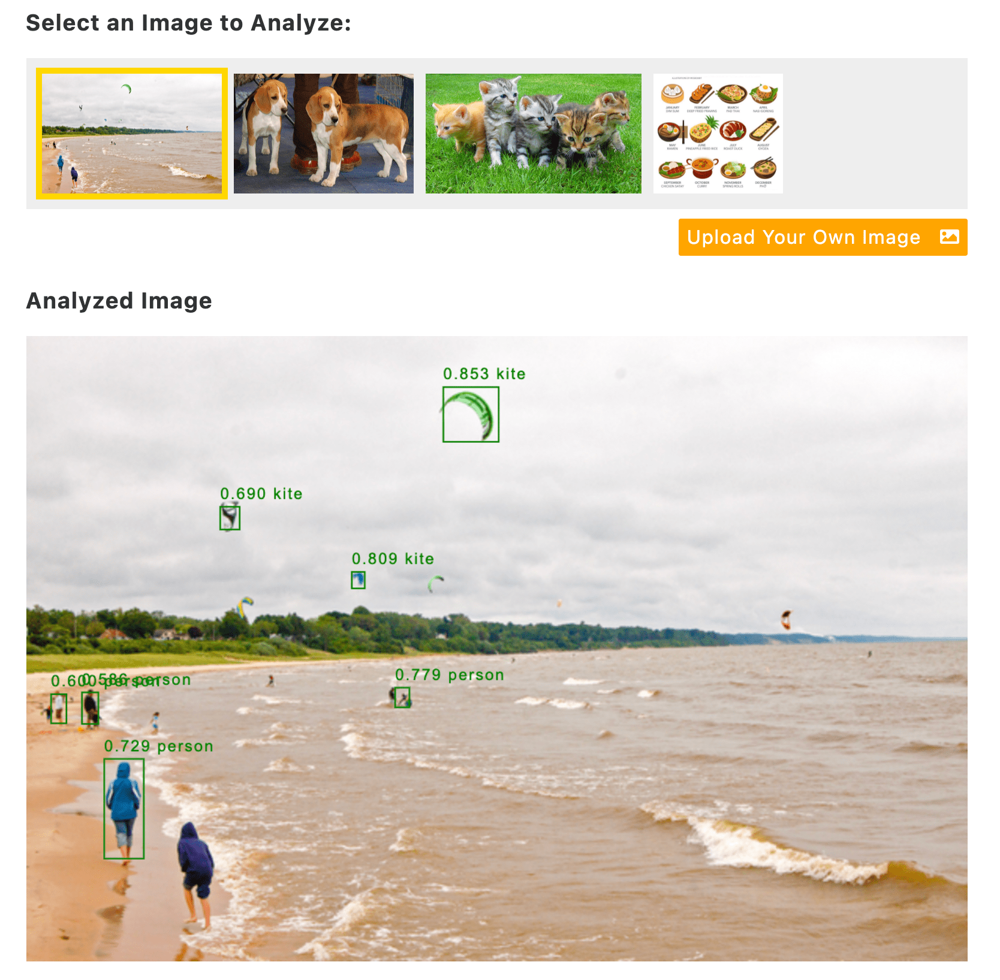

# Tensorflow.js Test

In-Browser Object Detection with SSD Mobilenet

https://harryli0088.github.io/tfjs-test/



## Deploying to Github Pages

Adapted from https://github.com/Sh031224/svelte-kit-github-page-example

1. Install ```adapter-static``` and ```gh-pages```
```
npm i -D @sveltejs/adapter-static@next gh-pages
```

2. Updated ```svelte.config.js```
```js
import static_adapter from '@sveltejs/adapter-static';

const config = {
  kit: {
    adapter: static_adapter({
      // default options are shown
      pages: 'build',
      assets: 'build',
      fallback: null
    }),
    paths: {
      base: process.env.NODE_ENV==="production" ? '/your-repo-name' : undefined,
    }
  }
};

export default config;
```

3. Add an empty ```.nojekyll``` file in your ```static/``` directory, otherwise GitHub Pages will ignore files with a leading underscore (ie ```_app/```)

4. Add a period in front of your favicon import in `src/app.html`
```html
<link rel="icon" href="./favicon.png" />
```

5. Add a deploy script to ```package.json```
```json
{
  "scripts": {
    "deploy": "npm run build && npx gh-pages -d build -t true"
  }
}
```

6. Run the deploy script
```
npm run deploy
```

## License

MIT License